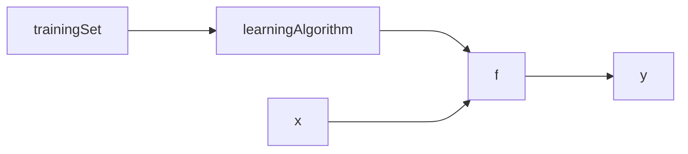

<!--- coding : utf8 --->
#### 监督学习和无监督学习
supervise learning and unsupervise learning

| supervise | unsupervsise |
|-----------| ------------ |
|给定x和y| 多为聚类|

 

#### 线性回归模型
简单描述，为数据拟合一条直线。利用已经知道的特征和标签去拟合一条直线，实现对不存在于数据集中的数据进行预测，例如 y = kx+b。

线性回归模型的训练过程:

其中这里的 **trainingSet** 是包含特征的训练集，交给**learningAlgorithm**得出来一个我们需要的模型**f**。**x** 被叫做输入特征，**$\hat{y}$** 是模型的预测(图中的y)，大概率不会是真实值，但是要尽可能接近真实值。

对于模型 **f** 的表示，可以写成这样子:

$f_{\vec{w},b}(\vec{x}) = \vec{w} \cdot \vec{x} + b$

**$\vec{x}$** 是一个目标的多个特征，在公式中用向量表达。那么权重 **$\vec{w}$** 也同样是一个向量表达的方式。其中$w$和$b$ 被称作parameters，w是weight，b是bias。weight可以看作是直线的斜率，bias可以看作是直线在y轴上的交点y数值。它们两个是模型训练过程中的目标。

$x_i$表示的是训练样本或者是输入样本的第 **i** 个特征，对应的$w_i$表示对应特征的权重参数数值，这两个参数组成了 **$\vec{x}$** 和 **$\vec{w}$**。

 

#### Cost function
成本函数是用来衡量预测和真实值之间的差距，采用计算所有测试集中的数据的预测和真实值进行差的平方，并且为了后续的梯度下降会增加一些参数，也就是：

$J(\vec{w},b) = \frac{1}{2m}\sum_1^m(\hat{y}^{(i)} - y^{(i)})^2$

其中$(\hat{y}^{(i)} - y^{(i)})$是error。

之后因为是使用模型 **f** 进行预测,所以可以把方程替换为:

$J(\vec{w},b) = \frac{1}{2m}\sum_1^m(f_{\vec{w},b}(x^{(i)}) - y^{(i)})^2$

也就是说我们需要找到的是可以让$\hat{y}$接近$y$的 $\vec{w}$ 和 $b$，**也就是说我们需要找到让成本函数 **J** 比较小的参数。

 

#### 梯度下降 gradient desecent
成本函数（）
想要最下滑成本函数
设置权重和偏置参数
持续改变权重和bias
直到代价函数得到最小值或者接近最小值

权重和bias更新公式（），赋值符号，偏导数项。梯度下降的过程用二次函数展示过程。
学习率的意义，也是用二次函数进行展示过程。学习率数值的选择。学习率过大无法收敛甚至发散。参数更新过程中，导数数值会变小，这会导致权重更新的步长越来越短。
局部最小值，因为更新函数的原因，当梯度为0的时候，w会不变此时也就是找到了最小值也可能是局部最小值，如果是局部最小值那可能不是目标但是此时的权重是无法进行更新的。
但是如果我们使用的是线性回归模型，不会出现局部最小值的情况，因为线性回归模型的cost function在梯度下降的图中展示出来的是一个碗装的凸函数，最终都可以找到最小值。

确定梯度下降是否收敛，每一次迭代都绘制出来cost function的数值，确定cost function数值是否逐渐趋近于收敛，并且在每一步J的变化都会越来越小，因为倒数数值会变小，但是如果下降速度太快可能是学习率设置过高。

 

#### 具备梯度下降的线性回归模型
linear regression model and cost function
gradient decsent algorithm 把线性回归带到cost function里面直接进行推导

 

#### 特征伸缩技术
特征值大选择较小的权重，特征值较小选择大一点的权重。
归一化，让特征值大的和特征值小的值都被控制在一定范围内之间，进而加快梯度下降的速度。
maximum normalization
mean normalization
Z-score normalization 计算标准差 平均值 高斯分布

