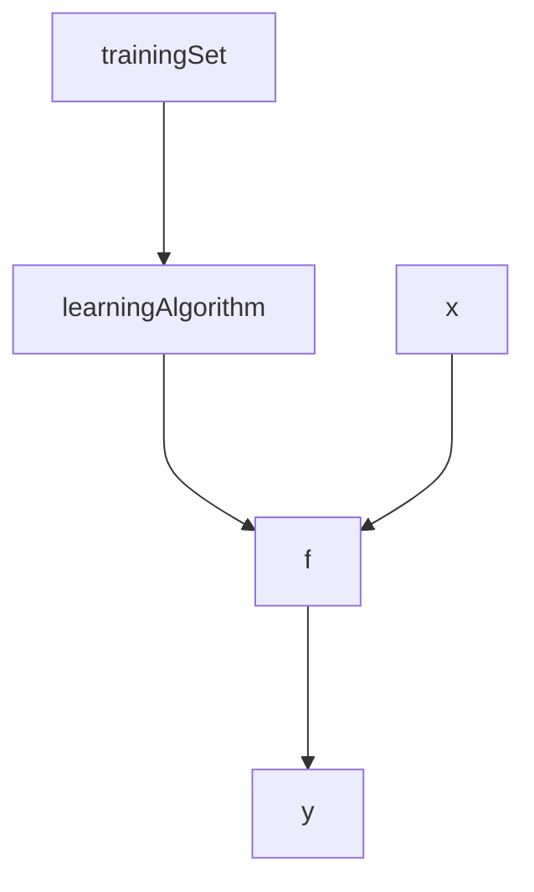

#### 监督学习和无监督学习
supervise learning and unsupervise learning

| supervise | unsupervsise |
|-----------| ------------ |
|给定x和y| 多为聚类|

 

#### 线性回归模型
简单描述，为数据拟合一条直线。利用已经知道的特征和标签去拟合一条直线，实现对不存在于数据集中的数据进行预测，例如 y = kx+b。

线性回归模型的训练过程:

其中这里的 **trainingSet** 是包含特征的训练集，交给learningAlgorithm得出来一个我们需要的模型**f**。**x** 被叫做输入特征，**$\hat{y}$** 是模型的预测(图中的y)，大概率不会是真实值，但是要尽可能接近真实值。

对于模型 **f** 的表示，可以写成这样子:

$f_{w,b}(x) = \vec{w}\vec{x} + b$

$\vec{x}$是一个目标的多个特征，所以数据多维，在公式中用向量表达。所以权重也会顺着这个形式进行训练。w,b被称作parameters，w是weight，b是bias。weight可以看作是直线的斜率，bias可以看作是直线在y轴上的交点y数值。

 

#### Cost function
成本函数是用来衡量预测和真实值之间的差距，采用计算所有测试集中的数据的预测和真实值进行差的平方，并且为了后续的梯度下降会增加一些参数，也就是：

$J(w,b) = \frac{1}{2m}\sum_1^m(\hat{y}^{(i)} - y^{(i)})^2$

其中$(\hat{y}^{(i)} - y^{(i)})$是error。

之后因为是使用模型 **f** 进行预测,所以可以把方程替换为:

$J(w,b) = \frac{1}{2m}\sum_1^m(f_{w,b}(x^{(i)}) - y^{(i)})^2$

也就是说我们需要找到的是可以让$\hat{y}$接近$y$的$w$和$b$，**也就是说我们需要找到让成本函数 **J** 比较小的参数。

 

#### 梯度下降
