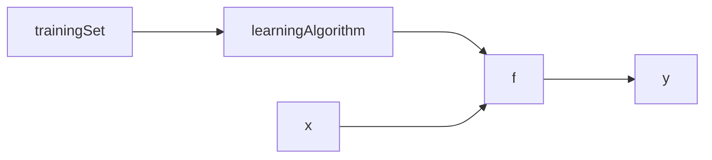
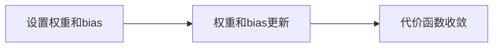

<!--- encoding : utf8 --->
#### 监督学习和无监督学习
supervise learning and unsupervise learning

| supervise | unsupervsise |
|-----------| ------------ |
|给定x和y| 多为聚类|

 

#### 线性回归模型
简单描述，为数据拟合一条直线。利用已经知道的特征和标签去拟合一条直线，实现对不存在于数据集中的数据进行预测，例如 $y = kx+b$。

线性回归模型的训练过程:

其中这里的 **trainingSet** 是包含特征的训练集，交给**learningAlgorithm**得出来一个我们需要的模型 **$f$**。**$x$** 被叫做输入特征，**$\hat{y}$** 是模型的预测(图中的y)，大概率不会是真实值，但是要尽可能接近真实值。

对于模型 **$f$** 的表示，可以写成这样子:

$$f_{\vec{w},b}(\vec{x}) = \vec{w} \cdot \vec{x} + b$$

**$\vec{x}$** 是一个目标的多个特征，在公式中用向量表达。那么权重 **$\vec{w}$** 也同样是一个向量表达的方式。其中 **$\vec{w}$** 和 **$b$** 被称作parameters， **$\vec{w}$** 是weight，**$b$** 是bias。weight可以看作是直线的斜率，bias可以看作是直线在y轴上的交点y数值。它们两个是模型训练过程中的目标。

**$x_i$** 表示的是训练样本或者是输入样本的第 **$i$** 个特征，对应的$w_i$表示对应特征的权重参数数值，这两个参数组成了 **$\vec{x}$** 和 **$\vec{w}$**。

 

#### Cost function
成本函数是用来衡量预测和真实值之间的差距，采用计算所有测试集中的数据的预测和真实值进行差的平方，并且为了后续的梯度下降会增加一些参数，也就是：

$$J(\vec{w},b) = \frac{1}{2m}\sum_1^m(\hat{y}^{(i)} - y^{(i)})^2$$

其中$(\hat{y}^{(i)} - y^{(i)})$是error。

之后因为是使用模型 **$f$** 进行预测,所以可以把方程替换为:

$$J(\vec{w},b) = \frac{1}{2m}\sum_1^m(f_{\vec{w},b}(x^{(i)}) - y^{(i)})^2$$

任务就是需要找到的是可以让$\hat{y}$接近$y$的 $\vec{w}$ 和 $b$，也就是说我们需要找到让成本函数 **$J$** 比较小的参数。

 

#### 梯度下降 gradient descent
梯度下降的目的就是找到可以让cost function的值最小的$w$和$b$。整个梯度下降的过程就是根据模型目标先设置$\vec{w}$和$b$的数值，之后把样本放入模型中进行训练。根据权重和bias的更新公式，对权重和bias进行更新，直到cost function数值逐渐趋近于收敛。

 
权重和bias更新方式是：

$$w := w - \alpha\frac{\partial J(\vec{w}, b)}{\partial \vec{w}}$$

$$b := b - \alpha\frac{\partial J(\vec{w}, b)}{\partial b}$$

其中，$\alpha$是learning rate，决定了参数更新的速度。$:=$代表赋值，可以直接理解为代码里面的赋值。之后把cost function带入并且进行计算，最后得到：

$$w := w - \frac{\alpha}{m}\sum_1^m(f_{\vec{w},b}(x^{(i)})-y^{(i)})x^{(i)}$$

$$b := w - \frac{\alpha}{m}\sum_1^m(f_{\vec{w},b}(x^{(i)})-y^{(i)})$$

$\vec w$和$b$唯一的区别就是式子最后的$x^{(i)}$。可以理解是$\vec{w}{x^{(i)}}$在偏导的时候保留了$x^{(i)}$，但是$b$并没有，所以偏导过程会被看作是常数，不进行考虑。

梯度下降的过程是指向cost function值下降的方向。当学习率较大的时候，更新的步子就会更大，学习率小的时候，更新的步子就会更小。学习率小的时候，缺点显而易见。学习率大的时候，学习率可能会跳过最小值，并且无法收敛甚至发散。整个过程中，由于偏导项数值逐渐变小，但是其他参数都是相对固定的，所以更新的幅度会越来越小。

因为更新函数的原因，当梯度为$0$的时候，$w$会不变。此时也就是找到了最小值也可能是局部最小值，此时参数更新的公式是不会起作用的。但如果使用的是线性回归模型，不会出现局部最小值的情况，因为线性回归模型的cost function在梯度下降的图中展示出来的是一个碗装的凸函数，最终都可以找到最小值。

确定梯度下降是否收敛，每一次迭代都绘制出来cost function的数值，确定cost function数值是否逐渐趋近于收敛，并且在每一步J的变化都会越来越小，因为倒数数值会变小，但是如果下降速度太快可能是学习率设置过高。

 

#### 具备梯度下降的线性回归模型
在gradient descent中已经创建完成。

 

#### 特征伸缩技术 feature scaling
归一化，让特征值大的和特征值小的值都被控制在一定范围内之间，进而加快梯度下降的速度。归一化有下面的三种方式。

1. maximum normalization：

$$x_i = \frac{x_i}{max}, min < x_i < max$$

1. mean normalization, if $x_i$ average is $\mu_i$:

$$x_i = \frac{x_i-\mu_i}{max-min},min<x_i<max$$

3. Z-score normalization, if standart deviation of $x_i$ is $\sigma_i$ and average is $\mu_i$ :

$$x_i = \frac{x_i-\mu_i}{\sigma_i},min<x_i<max$$

#### 

