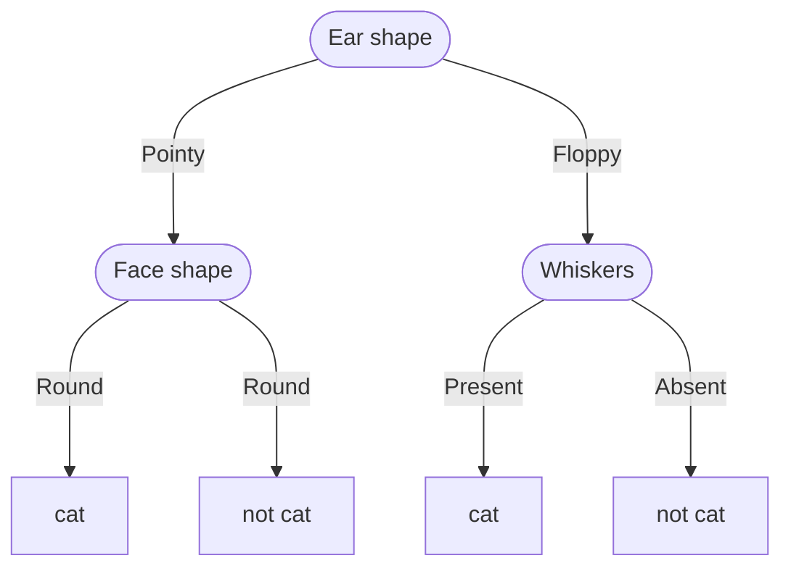

#### Decision Tree
从决策树的根节点开始，依次判断样本属于哪一个节点，直到样本被归类为一个叶节点，根据叶节点信息给出预测结果。可能训练多种decision tree去判断哪一个模型效果更好。

<center>


</center>
 
选择maximize purity的特征去分割每一个节点，也就是可以把数据集较为彻底地分成两个类别的特征，而不是选择一个特征之后可能分出来三四个类别。
停止分割需要具备：when a node is 100 percent one class; When splitting node will result the tree exceeding a maximum depth, 如果我决定树的深度是3，那么分割到深度3就停止下来; When improvements in purity score are below a threshold; When **number of examples** in a node is below threshold.

##### 测量节点purity

假设第一类$p_0$，第二类$p_1$，那么熵函数：
$$
H(p_1)
$$
Note：当$p_0$出现等于0的情况的时候，熵可以直接定义为0。

熵高代表不纯净，熵低代表纯净。如果样本中只有两类或者一类，0或者1要么就是只有0（1）那么熵就是0。降低熵或者说是学习决策树的过程可以叫做*信息增益*。

##### Information Gain
$$
Information \space gain = 
$$

##### 搭建决策树模型
- 
- 
- 
- 1
  - 1 
  - 
  -
  - 

```

```

**使用独热编码解决多类别的决策** ：把样本输入分成两种或者多种，其中属于和不属于分别映射到1和0。这种方式也可以作为神经网络的输入。
**分割连续值**：设定一个threshold，超过和不超过的分别属于两个类别。

<br />

<hr>

#### 回归树 —— 决策树在回归问题推广
和常见决策树的流程一样，但是到叶子节点之后，会给出一个回归值（这个取决于叶子节点上样本点的回归值如何计算）。

计算方差减小的公式，选择可以让方差减小最大的模型
$$

$$

<br />

<hr>

#### 多个决策树
如果使用不一样的根节点，最后可能会出现多个不一样的决策树模型。把他们结合起来，对分类或者回归结果进行一个“投票”操作，结果可能会更好。


##### Random Forest Algorithm
**sampling with replacemen**：随机从训练集中抽取一个样本出来并且放回，记录下被抽取出来的所需要的样本特征。

带sampling with replacement的多个决策树构造，或者叫做袋状决策树构造：
```
```
由于上面的袋状决策树的构造大大影响训练速度并且对算法提升不大，所以可以进行进一步的改进，也就是随机森林算法：


<br />

<hr>

#### XGBoost
随机选择样本特征，到第二次循环的时候不是以相等概率进行抽取特征，集中在某一些特征进行抽取。如果做得很好的例子上就减小概率，在做的不好的部分加大抽取的概率。
```
```

