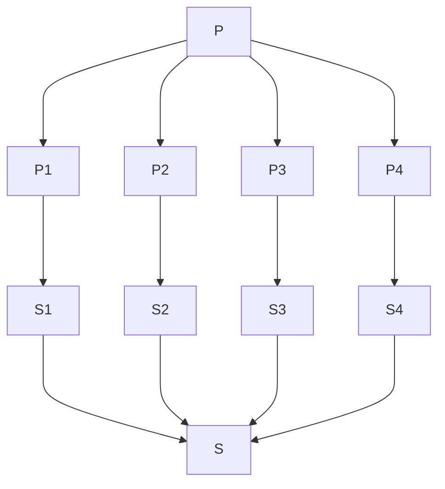
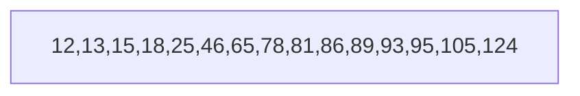

#### Devide-and-conquer Algorithm Describe

Problem **P** and its size is **n**. Then broken **P** down into smaller subproblems(the set **P~num~**)(can use 1 or more steps). Devied thses problem until all subproblems can be solved to obtain their solutions(the set **S** ). Finally, combine all the solutions of subproblem.

The type of subproblems is same as the problem. 

And when write devide and conquer algorithm, take it will be a recursive. Using some useful methods is important when combine the solutions of subproblems

<center>


</center>

<br />
<br />

#### Recurrence Relation and Recursive Function

Here is a recursive funchtion :

<center>

```
void test(int  n)
{
    if(n > 0)
    {
        for(i = 0;i < n; i++)
        {
            printf("%d", n);
        }
        test(n-1);
    }
}
```

</center>

First of all, analyze the time complexity. **T(n)** means the time complexity when **input n**. **"if()"**, **printf** sentences are both **1** unit time. **for()** sentence is **n+1** unit time. But the **printf** sentence in the loop. So the **printf** is **n** unit time. **test(n-1)** has **T(n-1)** time complexity. Now, i can simply write the time complexity of test(n):

<center>

$$
T(n)=\begin{cases}
1 & n=0 \\
T(n-1)+n & n>0
\end{cases}
$$

</center>

1. Then use **back substitution** (induction method):

<br />

#### Binary Search

Here has a array, input a number and find out it in array if the number exist. 

<center>



</center>

Now i will define some parameters. **key** is the target number(input number) what need be found in array or output messege no exist. **l** and **h** are the lowest and the highest index of array respectively. **mid** means the middle index of array. The relationship of mid and the 2 parameters l and h is : 

<center>

$mid=\frac{(l+h)}{2}$

</center>

Now set the **key** be 65. According to the input array, **l** and **h** are 0 and 14 respectively. So **mid** is 7.
Because the number of index 7 not equal to key and more than key, let the h value equal to **mid-1**. Then repeat above steps until find the key.

This is code:
```
int binSearch(Array, n, key)
{
    l, h = 0, n-1;
    while(l <= h)
    {
        mid = (l + h) / 2;
        if(Array[mid] == key)
        {
            return mid;
        }
        else if(Array[mid] < key)
        {
            l = mid + 1;
        }
        else
        {
            h = mid -1;
        }
    }
}
```